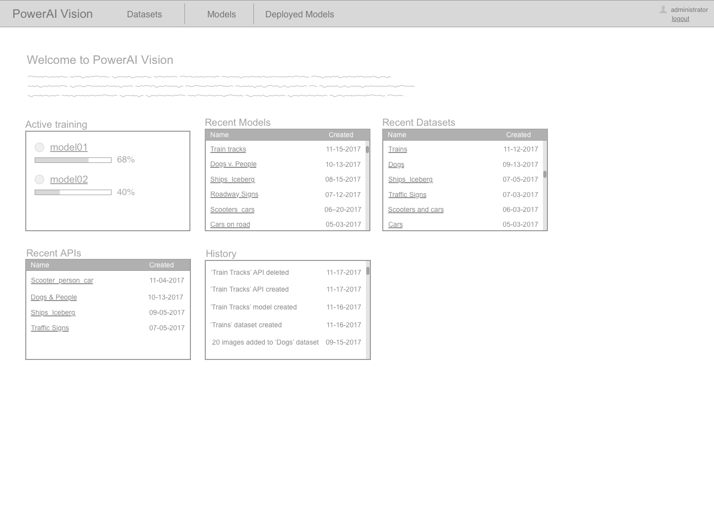

# Artboards

This is an autogenerated file showing all the artboards. Do not edit it directly.

## @Icons

## API - data row Copy 2

## API - data row Copy 3

## API - data row Copy

## API - data row

## API table header

## Auto Label component - auto label in progress

## Auto Label component - dataset selected

## Auto Label component - nothing selected

## Auto Label component - objects dropdown

## Auto Label component - objects selected

## Auto label component - select dataset modal - selected

## Auto label component - select dataset modal - unselected Copy

## Button & dropdown

## Categories - empty w

## Categories mobile

## Categories w

## Categories-desktop - no add

## Categories-desktop - training

## Checbox & radiobox

## Classification models - side panel

## Dashboard

## Dataset - duplicate dataset - 2 datasets

## Dataset - duplicate dataset modal

## Dataset - duplicate dataset

## Dataset - properties modal - multiple

## Dataset - properties modal

## Dataset - properties

## Dataset - sidepanel

## Dataset no objects empty set

## Datasets create set modal

## Datasets create set using images - advance collapse

## Datasets create set using images - advance open

## Deployed APIs detail Validation Results unselected

## Deployed APIs detail

## Deployed APIs

## Dropdown long

## Dropdown

## Dropzone

## Framework - tablet

## IMG - results

## IMG - selected

## IMG - unable to select

## IMG - unselected

## Image Boxer no objects selected Copy

## Image Boxer no objects unselected Copy

## Image Great Dane no objects selected

## Image Great Dane no objects unselected

## Image Great Dane objects selectd

## Image Great Dane objects unselected

## Image Great Dane video frames unselected Copy

## Image Library - pre-defined category selected

## Image Library - pre-defined category

## Image Library Desktop - add category Object save

## Image Library Desktop - add category modal  save

## Image Library Desktop - add category modal Object Detect

## Image Library Desktop - add category modal

## Image Library Desktop - add category only

## Image Library Desktop - auto label - auto train not progress

## Image Library Desktop - auto label modal open

## Image Library Desktop - auto label modal

## Image Library Desktop - auto label

## Image Library Desktop - categorized

## Image Library Desktop - edit key value attributes

## Image Library Desktop Copy

## Image Library Desktop Objects defined

## Image Library Desktop add more prompt

## Image Library Desktop edit images - add category

## Image Library Desktop edit images - classification no categories

## Image Library Desktop edit images - classification

## Image Library Desktop edit images

## Image Library Desktop train - not enough images message

## Image Library Desktop train - not enough images

## Image Library Desktop w

## Image Library Desktop

## Image Library Image Edit

## Image Library Image Edit Copy

## Image Library Image Edit

## Image Library Image Editobjects

## Image Library Video Edit

## Image Library empty add modal advanced opened

## Image Library empty add modal upload indicator

## Image Library empty add modal

## Image Library empty

## Image Library tablet

## Image library CTA - train disabled

## Image library CTA buttons - no auto train

## Image library CTA buttons

## Image no objects selected uncategorized

## Image no objects unselected uncategorized

## Indicator

## Input

## List View -- image library desktop w

## List View -- trained models

## Login tablet

## Navigation button

## Object box selected

## Precision

## Progress bar

## Progress bar

## Select All

## Sidebar - editing modal

## Sidebar - editing

## Sidebar background

## Stepper

## Tablet

## Toogle

## Trained models - multiple selected

## Trained models detail - Auto label flow - dataset selected

## Trained models detail - Auto label flow - labeling in progress

## Trained models detail - Auto label flow - selecting objects dropdown

## Trained models detail - Auto label flow Copy

## Trained models detail - Auto label flow

## Trained models detail - Validation results - advanced off

## Trained models detail - classification - precision

## Trained models detail - test results enlarged

## Trained models detail -object mAP advanced

## Trained models detail -object mAP

## Trained models

## Training finished - calssification simple

## Training finished - classification advanced

## Training in progress  - object mAP - advanced view

## Training in progress  - object mAP

## Training settings - customized

## Training settings - standard

## Unselect All

## Validation - deploy confirm modal

## Video - selected

## Video - unable to select

## Video - unselected

## Video Categorized - no objects unselected Copy

## Video Categorized no objects selected

## Video categorized objects selectd

## Video categorized objects unselected

## Videos - side panel

## add category

## add modal

## button

## button - deploy

## change view - list active

## change view - thumbnails active

## content header - datasets

## content header - deployed APIs

## content header - object detection video

## content header - object detection

## content header - trained models

## content header -img library many images selected copy

## content header -img library zero images selected

## copy

## dataset - add images modal

## dataset desktop selected copy

## dataset desktop unselected copy

## dataset desktop unselected

## dataset image

## datasets - side panel

## graph - circle graphs

## header desktop

## image lib - breadcrumb

## image metadata - wide

## img library - top right functions

## insufficient images modal

## list view - dataset - header

## list view - dataset - selected

## list view - dataset - unselected

## list view - dataset

## list view - image library item - Big Dogs

## list view - image library item - Great Dane

## list view - image library item - Groups of dogs

## list view - image library item video closed - German Shepard Copy

## list view - image library item video open - German Shepard

## list view - image library items - header

## list view - trained model content - big dogs model

## list view - trained model content - dogs v. people

## list view - trained model header

## mAP

## modal - deploy api object

## modal - train model Object detect

## modal - train model classification

## notebook_header

## notebook_metadata

## object - drawing box

## object - person

## object - selected great dane

## object detection - vert image carousel

## object detection models - side panel

## objects - read only

## objects desktop w

## objects desktop

## round plus

## scrollbar

## tablet - Dataset - thumbnail

## tablet - List View -- trained models

## tablet - image library list view

## tablet - training finished advanced

## tablet - training finished

## tablet Deployed APIs detail

## tablet header

## tablet list view - collapsed image library item - Great Dane

## tablet list view - expanded - image library item - Great Dane Copy

## tablet list view - image library items - header

## tablet sidebar

## toggle models classification Off

## toggle models type

## toggle switches disabled

## toggle switches

## top right menu - datasets

## top right menu - no edit no duplicate

## top right menu - no edit

## top right menu

## trained model - object

## trained model classification block

## training - mAP - graph

## training - precision

## training graph complete copy

## training graph complete simple - classification

## training graph complete

## training graphs - mAP - simple

## training graphs - mAP advanced

## training graphs

## validation UI - large

## validation UI narrow

## video player controls

